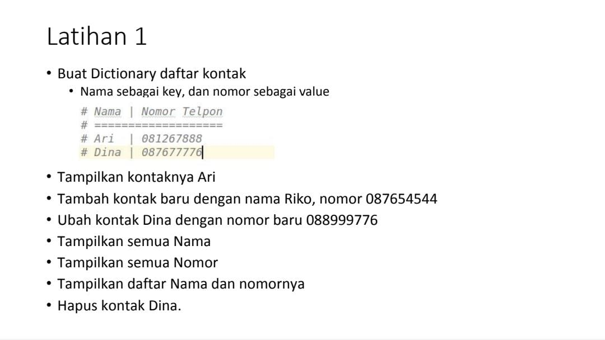

+ # praktikum5
+ # Tugas Praktikum 5
+ # Nama : Muhammad Din Al Ayubi
+ # NIM : 312210293
+ # Kelas : TI.22.A3

+ ## Tugas latihan 5
+ 
+ ## Source Code latihan5
+ '''python
+ 
+ daftarKontak = {"Nama":"Nomer Telpon"}
+ kontak       = {'Ayubi':'082317751464', 'Andi' : '087677776', 'Dapit' : '0877433331430'}
+ 
+ #print
+ print(30*"═")
+ print("    Nama    |  Nomor Telepon  ") #prinr daftarkontak
+ print(30*"-")
+ print("   # Ayubi    | ", kontak['Ayubi']) #print kontak Ayubi
+ print("   # Andi   | ", kontak['Andi']) #print kontak Andi
+ print("   # Dapit   | ", kontak['Dapit']) #print kontak Andi
+ print(30*"═")
+ 
+ #Tampilkan kontaknya Ayubi
+ print("Tampilkan kontaknya Ayubi")
+ print("    Ayubi     | ", kontak['Ayubi']) #print kontak Ayubi
+ print(30*"═")
+ #Tambah kontak baru dengan nama Albed, nomor 081212273539
+ print("Tambah kontak baru dengan nama Albed, nomor 081212273539")
+ kontak['Albed'] = '081212273539'
+ print("    Albed    | ", kontak['Albed'])
+ print(30*"═")
+ 
+ #Ubah kontak Andi dengan nomor baru 0876780147825
+ print("Ubah kontak Andi dengan nomor baru 0876780147825")
+ kontak['Andi'] = '0876780147825'
+ print("    Andi    | ", kontak['Andi'])
+ print(30*"═")
+ 
+ #Tampilkan semua Nama
+ print("Tampilkan semua Nama")
+ print(kontak.keys())
+ print(30*"═")
+ 
+ #Tampilkan semua Nomor
+ print("Tampilkan semua Nomor")
+ print(kontak.values())
+ print(30*"═")
+ 
+ #Tampilkan daftar Nama dan nomornya
+ print("Tampilkan daftar Nama dan nomornya")
+ print(kontak.items())
+ print(30*"═")
+ 
+ #MengHapus kontak Andi
+ print("Hapus kontak Dapit")
+ kontak.pop('Dapit')
+ print(kontak.items())
+ print(30*"═")
+ 
+ '''